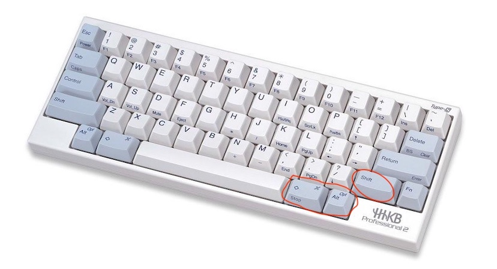
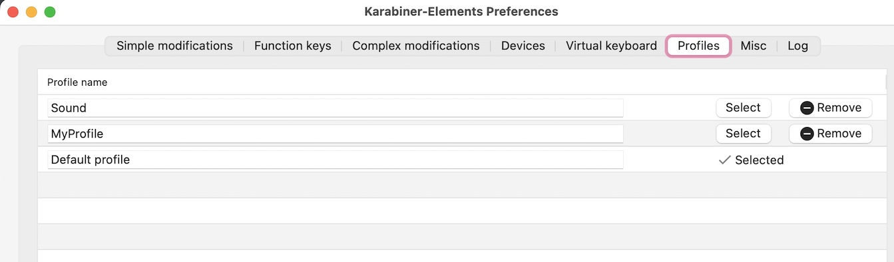
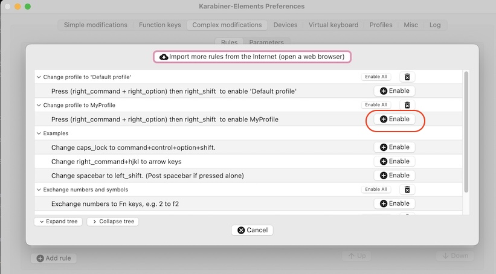
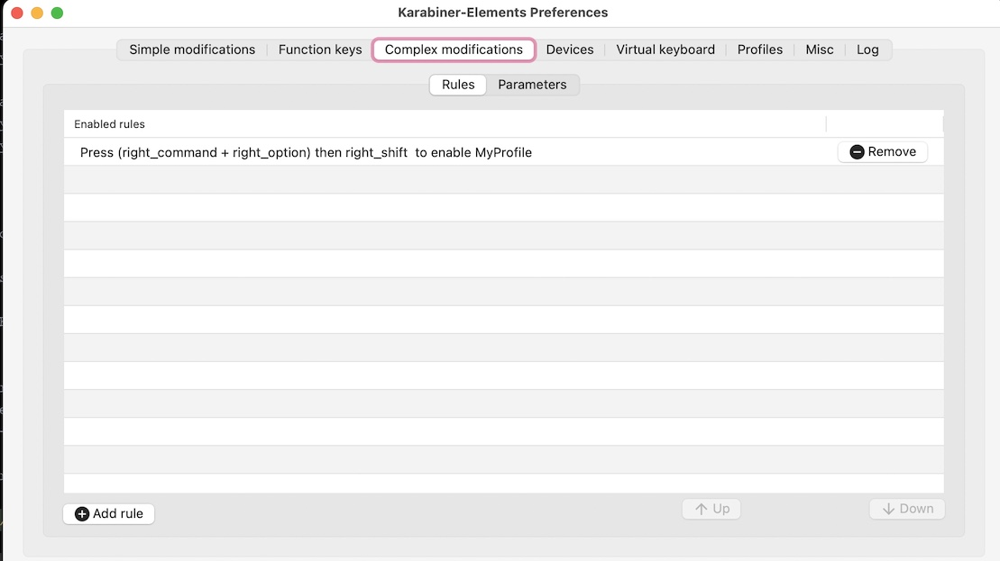
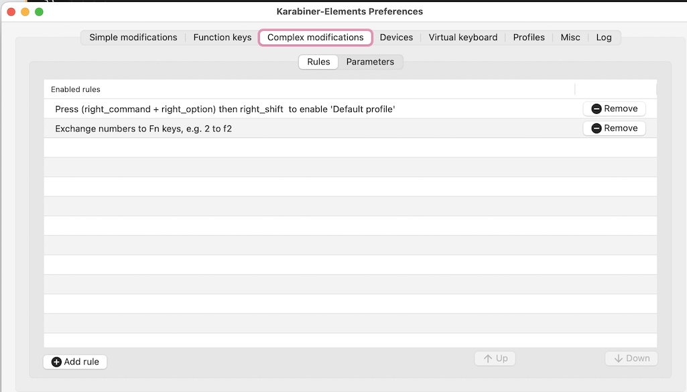
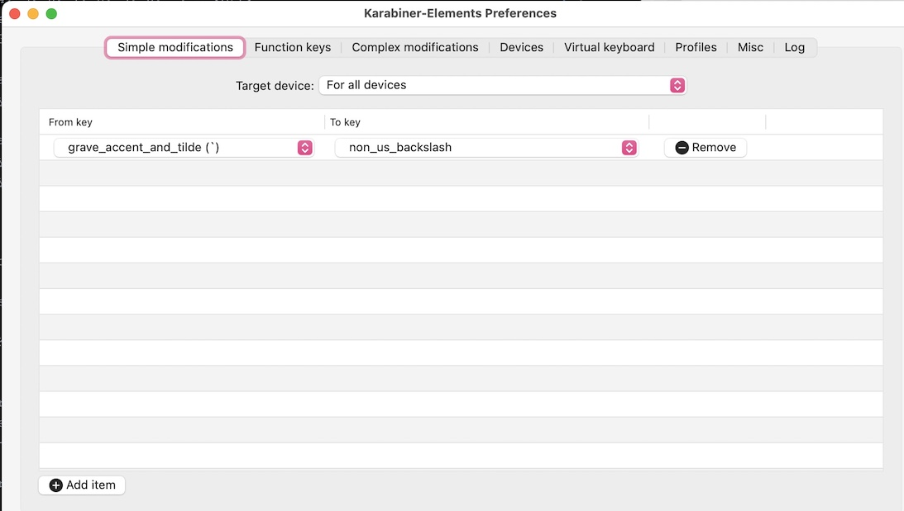
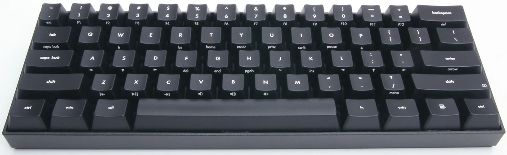
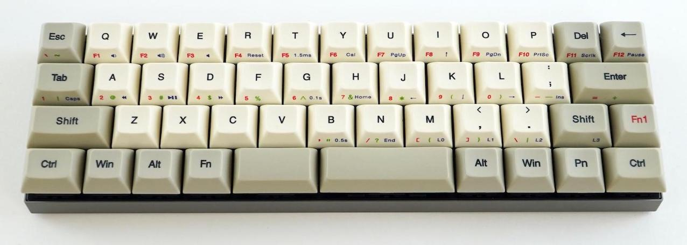

# karabiner_hhkb_profile

**Karabiner-Elements profile for HHKB or 60% keyboard**

This project will provide HOW-To instructions to configure Karabiner-Elements in Mac so user can press a single number key
(i.e. 1, 2, 3,... 9, 0, -, =) to trigger a function key (i.e. F1, F2,... , F9, F10, F11, F12) on a HHKB(i.e. Happy Hacking
Keyboard) or 60% keyboard.



<br/>

**Motivation**

By default, A function key (e.g. F1) can be registered by pressing down the Fn key on bottom right corner and Number 1 key
on top left at the same time. This required two hands to pull it off. Things only get worse if you need to press three keys
involving a function key at the same time, e.g. _F7+Ctrl+Shift_. And yes, good developers do enjoy pressing three keys as
shortcut in their favorite IDE(e.g. IntelliJ) to make things happen instead of using mouse to navigate and click around.
But with a 60% keyboard, that is really pushing the limit of your hand doing Mudra. 🙌

So what's the point of using an expensive(_supposedly cool_) **HHKB** keyboard if it's only going to make your life
difficult during development in your favorite IDE?... No point actually except for the [bragging right](https://www.youtube.com/watch?v=uHt01D6rOLI) in the office! 😆
<br/>

Naturally anyone with good common sense will start looking for a free open source key remapping software. Out of this
comes the tested solution in this guide, something I wish I had known much earlier when I first got my HHKB several years
ago... _You are welcome_.

<br/>

**Design**

A mechanism will be required to switch the layout of keyboard such that the following keys

* 1, 2, 3, 4, 5, 6, 7, 8, 9, 0, -, = <br/>
  will be remapped to the following function keys
* F1, F2, F3, F4, F5, F6, F7, F8, F9, F10, F11, F12 <br/>

Then user can simply press a key to register a function key **with a single hand** before quickly switching back to
original layout.

Switching layout will be done by pressing down both the _right Command + right Alt_ keys(these are what's called the
modifier keys) then click right _Shift_. See highlighted keys in image above. Repeating it again will switch back to
original layout.

Karabiner-Elements actually allows us to implement a kind of Plug and Play type of framework where a keys remapping profile
can be created for each keyboard as a JSON file to be imported in as a Rule in 'Complex modifications' tab(which we will
see latter) on the need to use basis. So when user switches a keyboard, just adds a new Rule(e.g. hhkb-profile.json,
kbp-v60-mini.json) for the targeted keyboard and removes the old Rule for the previous keyboard.

<br/>

**Instructions**

Instructions provided here will be for Mac so no luck for Windows user, time to get on with the programme... 😁
Actually for Windows user, your best bet is to use either AutoHotKey or SharpKeys.

1. Install Karabiner-Elements. I am using 14.4.0 at time of writing this.
2. Open the folder **~/.config/karabiner/assets/complex_modifications** then drop the following files in from the provided 'profile' folder

* default-profile.json
* my-profile.json
* number-to-fn.json

3. Open *Karabiner-Elements*, go to *Profiles* tab and add two profiles, 'MyProfile' and 'Default profile'. See

   

   <br/>
4. Select 'Default profile' as in screenshot above. Click 'Complex modifications' tab to bring up the panel showing a
   list of Rules you imported in JSON files above, i.e. each JSON file is represented as a Rule here. Click the 'Enable'
   button to use the rule _Change Profile to MyProfile_(i.e. my-profile.json). See

   

   After that you should see
   

<br/>

5. Repeat step 4 above for MyProfile except this time, pick the rule _Change profile to 'Default profile'_(i.e. default-profile.json)
   to enable in 'Complex modifications' tab. Also enable the Rule '_Exchange numbers to Fn keys..._'(i.e. number-to-fn.json)
   while you are at it. Now you should have
   

If you make it this far, congratulation, you can now quickly do Cmd+Shift+F9 as if you are using a full size or 80% keyboard
in IntelliJ after quickly switching layout to confuse the hell out of your colleague who is watching. If colleague asks
how, let him try and fails then tell him he needs to be the chosen ONE to make it work. 😆

Now if you take a closer look of HHKB picture above, you will see Fn key is a bit far away from Home/End key. Wouldn't it
be more comfortable to use if Fn is shifted to right Command key for mapping of '_arrow keys, Page_up, Page_down, Home and
End keys_'? So one's right thumb can press down on right Command and other fingers will access Home/End/... keys in an
intuitive way. That's where the profile **hhkb-profile.json** comes in. Drop the JSON file in complex_modifications folder,
then enable the Rule 'HHKB profile' in 'Complex modifications' tab of both 'Default profile' and MyProfile profiles. Done!

<br/>

**Issues...**

One flaw of using Karabiner-Elements with HHKB in Mac is that the character **`** will get interpreted as **§**. But this can be
solved by adding more customization in Karabiner-Elements. In 'Simple modifications' tab, simply add the config below.



<br/>

**Bonuses**

Anyone with big brain can see an immediate problem with the shortcut (i.e. _right Command + right Alt + right Shift_) keys
above to change layout, that is, many 60% or 70% keyboards don't even have right Alt key! A perfect example would be the **KBParadise V60 Mini keyboard**.



To get around that, we can simply add shortcut to the left-hand side so _left Ctrl + left Command + left Shift_ will change
profile. To top it off, we can also add in audio cue to let user know profile change is successful. The following script
in default-profile.json will do the tricks.

```json
 {
      "from":
      {
         "key_code": "left_shift",
         "modifiers":
         {
            "mandatory": [
               "left_control",
               "left_command"
            ]
         }
      },
      "to_after_key_up": [
      {
          "shell_command": "afplay /System/Library/Sounds/Basso.aiff"

      }],
      "to": [
      {
          "shell_command": "'/Library/Application Support/org.pqrs/Karabiner-Elements/bin/karabiner_cli' --select-profile 'Default profile'"
      }],
      "type": "basic"
  }
```

Similar script will be in my-profile.json except it will play a different sound and switch profile to 'MyProfile'.
Now regardless of how cool this 60% keyboard looks, it's actually a **nightmare** to use for developer since

* Fn + T = Home
* Fn + G = End
* Fn + Y = Page Up
* Fn + H = Page Down

These require the use of two hands to do it comfortably even though there are many 60% keyboards that allow you to use
right hand to do these. So who in their right mind would buy this one? Unfortunately I wasn't in the right mind so I
did buy this one and regretted after using it for coding. But fear not, I have created another profile
**kbp-v60-mini.json** to get around the problem. Just put it in the usual 'complex_modifications' folder above and
import it(i.e. the Rule having description '_KBParadise V60 Mini profile_') in 'Complex modifications' tab of profile
'Default profile'. Do this again for the profile 'MyProfile'

_kbp-v60-mini.json_ basically does the following remapping to allow right hand to do it all! 👌

* Fn + , = Home
* Fn + . = End
* Fn + O = Page Up
* Fn + K = Page Down

You are welcome...

<br/>

**Exercises**

Many mechanical keyboards have dedicated knob or buttons to adjust and mute volume to justify its high price.
These can be replicated easily in Karabiner-Elements by remapping

* _Print Screen_ key to Mute Sound
* _Num Lock_ key to Increase volume
* _Pause_ key to Decrease volume

Do these by adding three elements in 'Simple modifications' tab. Will leave it as exercise to the user. ;)

Note if you want to create your own rules in JSON files to import into 'Complex modifications' tab,
Karabiner-EventViewer lets you click the key you want and print out the key code of pressed key. Handy for remapping keys.

<br/>

**So What's Next...**

For dessert 🥮, we have the small infamous **Vortex Core** 40% keyboard that only the most elite keyboard enthusiast(or lunatic)
will use


Until next time, stay tuned to find out... 🖐🏻
